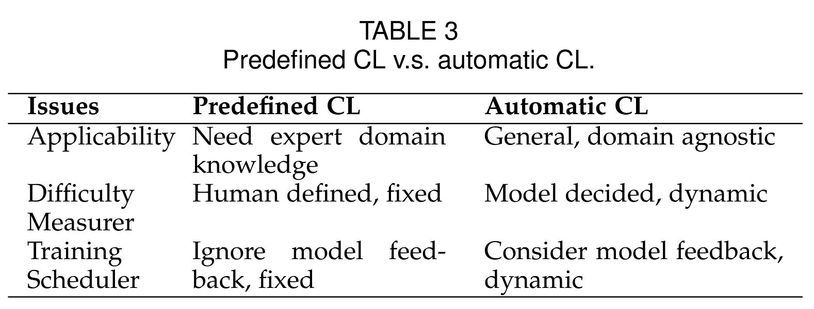
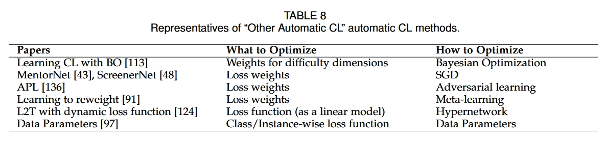

# A Survey on Curriculum Learning
作者：Xin Wang, Yudong Chen, Wenwu Zhu（清华大学）
发表于：IEEE Transactions on Pattern Analysis and Machine Intelligence
原文链接：https://arxiv.org/pdf/2010.13166

---

## 摘要

课程学习（Curriculum Learning, CL）是一种训练策略，模仿人类的学习顺序，从简单样本逐步过渡到复杂样本，从而训练机器学习模型。作为一种易于使用的插件式策略，CL 已被广泛应用于如计算机视觉、自然语言处理等多种任务中，在提升模型泛化能力和收敛速度方面表现出显著优势。

在本综述中，我们从多个方面全面回顾了课程学习，包括其动机、定义、理论基础和应用场景。我们在通用课程学习框架下讨论了课程设计问题，重点介绍了如何设计预定义课程学习与自动课程学习。在方法论上，我们基于“难度评估器（Difficulty Measurer）+训练调度器（Training Scheduler）”的通用框架，系统总结了现有 CL 方法，并将自动课程学习细分为四类：自节奏学习（Self-paced Learning）、迁移教师（Transfer Teacher）、强化学习教师（RL Teacher）及其他自动方法。

我们还分析了在实践应用中选择不同 CL 设计的原则，最后探讨了课程学习与迁移学习、元学习、持续学习和主动学习等相关概念之间的联系，并指出当前课程学习面临的挑战及未来值得进一步研究的方向。

**关键词**：课程学习，机器学习，训练策略，样本重加权，自节奏学习

图1：课程学习过程示意

---

## 1 引言

人类学习的启发作用贯穿了机器学习算法的发展历程。课程（Curriculum）作为人类学习的一个突出特征，即按照有意义的顺序进行学习，也逐步被引入机器学习领域，从而形成了“课程学习（Curriculum Learning）”这一子领域。

本质上，人类教育是一种高度组织化的课程体系，从小处着手并逐步扩展到复杂概念。例如，在大学学习微积分之前，学生通常需要先在小学掌握基础算术，在初中学习函数概念，再在高中接触导数知识。

然而，传统的机器学习算法通常是将所有训练样本以随机顺序输入模型，忽略了数据样本的复杂性以及模型当前的学习状态。因此，一个直观的问题是：**课程式的训练策略能否提升机器学习的表现？**

从早期的实验证据 \[6], \[54], \[131] 到近期的大量应用研究 \[17], \[29], \[33], \[86]，这一问题的答案可以概括为：**“可以，但并非总是有效。”** 课程学习的效果取决于课程设计是否适用于特定的任务与数据集。

课程学习的概念最早由 Bengio 等人 \[6] 提出。简言之，课程学习的基本思想是“从简单样本训练到复杂样本”。具体来说，课程学习首先使用较简单的数据子集（或子任务）训练模型，随后逐步引入更具挑战的数据（或任务），直至使用完整训练集完成训练。

图 1 以图像分类任务为例展示了课程学习的过程：初始阶段，CL 在清晰、典型、容易识别的图像（如苹果和橙子的图像）上训练模型；随着训练的进行，引入更具挑战性的图像；最终，模型使用整个训练集进行训练。

由于 CL 的思想作为一种通用训练策略，可以超越具体的机器学习任务，因此研究者在多个应用场景中探索其潜力，涵盖了有监督学习任务（计算机视觉 \[31], \[40]、自然语言处理 \[86], \[112]、医疗预测 \[14] 等）、强化学习 \[20], \[77], \[93]，甚至图学习 \[25], \[88] 和神经结构搜索 \[32]。

课程学习训练策略在实际应用中的两个主要优势可以总结如下：

* **提高模型性能**：在复杂或高噪声任务中获得更优表现
* **加快训练过程**：减少模型收敛所需时间

例如，\[86] 中 CL 使得神经机器翻译模型训练时间减少多达 70%，性能提升最高达 2.2 BLEU 分数；在 \[41] 的多媒体事件检测任务中，CL 使 MAP 得分相较常规训练提高了 45.8%，同时收敛速度更快；\[20] 中的 RL 应用表明，CL 能够帮助代理解决本来难以完成的目标导向任务。

除此之外，CL 还具有高度可用性：它作为一种灵活的“插件模块”，不依赖原始训练算法的大幅修改。

然而，至今仍缺乏对课程学习方法与应用的系统性总结。本文试图填补这一空白，全面回顾课程学习并梳理其方法学。我们希望读者在阅读本文后，能对以下问题形成清晰认识：

1. 课程学习的定义是什么？（第 2 节）
2. 为什么课程学习有效？研究者为什么要使用它？（第 3 节）
3. 如何设计课程？（第 4 节）

本文最后还将比较“先易后难”与“先难后易”训练策略的差异，讨论课程学习与其它机器学习概念（如迁移学习、元学习、持续学习等）的关系（第 5 节），并在第 6 节提出课程学习当前的开放问题与未来研究方向。

---

## 2 课程学习的定义

### 历史背景

在人类和动物学习领域，课程顺序的有效性早已在行为和认知科学中得到实证支持。Skinner \[84], \[105] 是最早提供“塑造”（shaping）证据的研究者，这一术语在动物训练中相当于课程学习。认知证据方面，包括人类的大小恒常性学习 \[116] 和语言学习 \[79] 也支持“由易到难”的训练策略。

将课程思想引入机器学习最早可以追溯到 Selfridge 等人 \[99] 的工作。作者建议先用较长且较轻的杆子训练倒立摆控制器，再逐步使用更短更重的杆子。后续如 \[95], \[98] 也在强化学习和机器人领域探讨了由易到难的任务呈现顺序。

在有监督学习领域，Elman \[15] 是首位尝试将课程思想用于语法学习任务的研究者。他在训练递归神经网络时强调“从小开始”：即在训练初期限制数据范围。该策略在 \[94], \[52] 等后续研究中被再次验证。

在上述工作的基础上，Bengio 等人 \[6] 正式提出课程学习的定义，并在图像与语言任务上展开实验，探索课程学习何时、为何有效。

### 原始定义（Definition 1）

一个课程是 T 个训练步骤上的训练准则（training criteria）序列：

$C = \langle Q_1, Q_2, ..., Q_T \rangle$

其中每个准则 $Q_t(z)$ 是对目标训练分布 $P(z)$ 的重加权：

$Q_t(z) \propto W_t(z)P(z), \forall z \in D$

该定义需满足以下三条性质：

1. 分布熵递增：$H(Q_t) < H(Q_{t+1})$
2. 样本权重递增：$W_t(z) \leq W_{t+1}(z)$
3. 最终等于原始分布：$Q_T(z) = P(z)$

简而言之，课程学习是一种使用上述课程序列训练模型的策略。

### 广义定义（Definition 2）

放宽上述三条限制，课程定义为 T 步中对训练分布的重加权序列。课程学习即是在此课程基础上训练模型的策略。

这种定义允许课程是“难到易”或“先全后精”等非传统顺序，且包含困难样本挖掘（HEM）等策略。

### 更抽象定义（Definition 3）

课程被视为训练过程中准则（例如损失函数、监督生成、模型容量等）的序列，策略是在此基础上训练模型。

例如 Curriculum Dropout \[75] 中，训练时动态减少 dropout 激活单元的比例；Curriculum NAS \[32] 中，搜索空间从小到大逐步扩展。

这些扩展进一步丰富了课程学习的内涵，也为未来的研究提供了想象空间。

---

## 3 课程学习的有效性分析以及适用场景

尽管课程学习的理念直观且类比于人类学习过程，但它为何能提升模型性能仍是值得深入探究的问题。我们从以下两个主要视角分析其有效性：

### 3.1 课程学习的理论分析

#### 从优化问题视角的解释

课程学习可被视为连续逼近（Continuation Method）的一种策略。在非凸优化问题中，直接优化最终目标函数往往易陷入局部最优，而连续逼近方法通过先优化一个较平滑、较易求解的代理目标，再逐步过渡到原始复杂目标，从而提高优化效率。

图2：连续逼近策略示意

在课程学习中，早期训练阶段使用的是更简单的数据子集，对应着更容易优化的损失面，随后逐步加入更复杂的样本，从而实现平滑过渡。

这种方式尤其适用于训练深层神经网络，因为神经网络的损失函数高度非凸且包含多个鞍点与局部极小值。课程学习通过简化优化过程，有助于模型避开差的局部最优，提升泛化性能。

#### 从数据视角的解释

另一个理解课程学习有效性的视角是“数据分布的调控”。在许多实际应用中，训练集往往包含异常值、噪声数据或标注错误，这些数据可能干扰模型训练。

课程学习通过优先使用“简单”、“可靠”的样本，可以起到“去噪”效果，从而使模型建立更稳健的初始表示。

在弱监督学习或标签不完整、数据异构的场景中，这一特性尤为关键。例如在医疗预测、远程感知等领域，课程策略可以先从置信度高的样本学习，再逐步引入低置信度或潜在伪标签的样本。

图3：从数据分布视角解释课程学习

### 3.2 适合课程学习的应用场景

归纳来看，研究者使用课程学习的动机主要有以下两类：

| 使用动机 | 效果 | 场景 | 典型任务 |
| --- | --------------- | ---------------  | ------------------------------ |
| **引导学习** | 提升最终性能或加快训练收敛速度 | 目标任务很难或者有不同的分布 | 稀疏奖励强化学习、多任务学习、GAN训练、NAS、迁移学习、不平衡分类等 |
| **去噪建模** | 加速训练，提升模型的泛化性与鲁棒性 | 具有噪声、低质量、混杂数据的任务 | 弱监督或无监督学习、自然语言处理任务（机器翻译、自然语言理解）等 |

例如，在训练生成对抗网络时，CL 可逐步引入难判别样本，使生成器与判别器更平稳地博弈；在自然语言推理任务中，可先训练容易分类的句子对，再过渡到边界模糊样本，有效减少训练误导。

### 小结

课程学习之所以有效，既因其优化上的渐进性，亦源于其在数据分布控制上的策略性。通过调整样本呈现顺序，课程学习实质上改变了训练动态，有助于模型以更合理的路径建立能力。

---

## 4 课程设计的一般框架

课程学习的核心问题是：**如何设计课程？**这涉及两个关键组成部分：样本的“难度评估”与“调度策略”。

我们将现有的大多数课程学习方法归纳为一个统一的框架，即：

> **课程设计 = 难度评估器（Difficulty Measurer） + 训练调度器（Training Scheduler）**

### 4.1 难度评估器+训练调度器的一般框架

* **难度评估器**用于度量样本的“难易程度”
* **调度器**根据难度信息安排训练顺序

我们据此将课程学习方法分为两类：

1. **预定义课程学习（Predefined Curriculum Learning）**：人工指定课程顺序与难度
2. **自动课程学习（Automatic Curriculum Learning）**：模型或策略自动学习合适课程

下文将分别展开介绍。

### 4.2 预定义课程学习（Predefined CL）

预定义课程方法是最早被采用的课程设计形式，其基本流程如下：

* 研究者基于先验知识设计难度评估函数
* 将训练样本按难度划分为多个等级或子集
* 按固定顺序或计划将这些子集引入训练过程

#### 4.2.1 难度评估器

下表总结了不同任务中常用的人工难度评估指标：

表2：常见预定义难度评估器

示例：在图像识别中，清晰、中心、背景干净的图像可认为更容易；在自然语言处理任务中，长度短、结构简单的句子通常更易理解。

#### 4.2.2 调度器设计

预定义课程的调度方式主要有以下几类：

* **Baby Step（逐步合并）**：每轮引入新子集时保留旧子集，训练集不断扩大
* **One-Pass（单次切换）**：每轮只训练当前等级样本，不保留旧样本
* **函数调度器**：基于预设数学函数动态调整训练分布（如线性、根号、指数函数）

图 4：连续调度器的可视化

数学调度器示例：

* 线性：$\lambda(t) = \min(1, \lambda_0 + \alpha t)$
* 根号：$\lambda(t) = \sqrt{t / T}$
* 指数：$\lambda(t) = 1 - e^{-\alpha t}$

#### 4.2.3 局限性分析

尽管简单直观，人工课程方法存在以下问题：

* **设计难**：需任务先验知识，人工划分主观性强
* **泛化差**：不同任务需重新定义难度指标，迁移性弱
* **反馈滞后**：训练过程不能根据模型状态动态调整
* **超参多**：调度策略涉及大量不可学习的超参数（如起始难度、增长速率等）

这些问题促使研究者探索更具自适应性的“自动课程学习”方法。

---

## 5 自动课程学习（Automatic Curriculum Learning）

为克服人工课程方法的局限性，研究者提出了自动课程学习策略，其核心思想是**利用模型反馈信息，动态学习课程顺序**。

表 3：预定义课程学习与自动课程学习的比较

我们将自动课程学习方法分为四大类：

1. **自定进度学习（Self-paced Learning, SPL）**
2. **迁移教师（Transfer Teacher）**
3. **强化学习教师（Reinforcement Learning Teacher）**
4. **其他方法（如贝叶斯优化、元学习等）**

图 5：课程学习分类

---

### 4.3.1 自定进度学习（Self-Paced Learning，SPL）

自定进度学习（Self-Paced Learning，SPL）是课程学习的一个重要分支，通过采用当前模型对样本的训练损失作为判断标准，自动化实现难度评估器（Difficulty Measurer）的功能。SPL 的概念源自人类教育：学生可以自行控制学习内容、方式、时间和节奏 \[115]。在机器学习背景下，SPL 最早由 Kumar 等人 \[54] 提出，其策略是：每轮迭代中模型只使用当前训练损失最小的一部分样本进行训练，这一“最容易样本”的比例会逐渐扩大，直到覆盖整个训练集。换言之，SPL 实际上采用了第 4.2.2 节中的预定义训练调度器（Training Scheduler）。在文献中，CL 和 SPL 有时被区分为两个策略，其中 CL 通常指代预定义课程学习，而 SPL 被视为独立方向。但本文将 SPL 归为自动化课程学习的一类，因为它与 CL 本质一致，并完美契合本综述所提出的通用框架（见图 2(b)）。相比预定义 CL，SPL 的两大核心优势是：

1. SPL 是一种“半自动”的课程学习方式：其难度评估器基于损失自动调整，学习进度动态变化，因而更灵活，能适应各种任务和数据分布；
2. SPL 将课程设计内嵌于原始任务的学习目标中，作为一个可插拔模块适用于各种模型。

---

### a）SPL 原始版本

Kumar 等人提出的原始 SPL 算法定义如下。令训练集为 $D = \{x_i, y_i\}_{i=1}^N$，其中 $x_i$ 是输入特征，$y_i$ 是标签。模型 $f_w$ 由参数 $w$ 控制，对样本 $x_i$ 预测输出 $f_w(x_i)$，对应损失为 $l_i = L(f_w(x_i), y_i)$。原始目标是最小化整个训练集上的经验损失：

$$
\min_w \sum_{i=1}^N l_i + R(w) \tag{6}
$$

其中 $R(w)$ 是正则项，用于防止过拟合（以下分析中略去该项）。SPL 在此基础上引入样本权重向量 $v = [v_1, \dots, v_N]^\top \in [0, 1]^N$，以及称为“学习年龄”（age parameter）的超参数 $\lambda$，控制每轮训练纳入的样本比例。目标函数变为：

$$
\min_{w, v \in [0, 1]^N} \sum_{i=1}^N v_i l_i + g(v; \lambda) \tag{7}
$$

其中 $g(v; \lambda)$ 为 SPL 正则项（SP-regularizer），控制样本筛选策略。在原始 SPL 中：

$$
g(v; \lambda) = -\lambda \sum_{i=1}^N v_i \tag{8}
$$

该目标通常通过交替优化策略（AOS）求解：固定 $w$ 优化 $v$，再固定 $v$ 优化 $w$。其中：

* 固定 $w$ 后，$v_i$ 的最优解为：

$$
v_i^* =
\begin{cases}
1, & l_i < \lambda \\
0, & \text{否则}
\end{cases} \tag{11}
$$

* 固定 $v$ 后，用标准梯度下降更新 $w$。

算法 2 给出了完整过程：

算法 2 SPL算法

---

### b）SPL 的理论分析（Theories for SPL）

在介绍各种增强版本的 SPL 之前，本文先简要总结 SPL 的相关理论研究。目前，已有相当完善的理论体系支持 SPL 的收敛性、鲁棒性和本质解释，为其广泛应用奠定了基础。

首先，SPL 的目标函数（公式 (7)）可以等价地转换为如下的“潜在目标函数”（latent objective function）：

$$
\sum_{i=1}^{N} F_\lambda(l_i) = \sum_{i=1}^{N} \int_0^{l_i} v_i^*(\tau, \lambda) \, d\tau \tag{12}
$$

其中，$v_i^*(\tau, \lambda)$ 是在公式 (9) 中得到的最优解。Meng 等人 \[73] 首先证明：SPL 中使用的交替优化策略（AOS）本质上等价于\*\*最大化-最小化算法（Majorization Minimization, MM）\*\*在上述潜在目标函数上的最小化过程。因此，我们可以利用 MM 理论来分析 SPL 的性质（例如收敛性）。

此外，他们还发现该潜在目标函数 $\sum_{i=1}^N F_\lambda(l_i)$ 与非凸正则项（Non-Convex Regularized Penalty, NCRP）密切相关。NCRP 是一个知名的机器学习方法，具有稀疏估计与鲁棒学习等优良性质。这进一步从理论层面揭示了 SPL 的鲁棒性。

基于上述研究，作者还进一步证明，在温和条件下，SPL 优化过程中的迭代能够收敛到该潜在目标函数的**临界点（critical points）**，从而建立了 SPL 收敛性的理论基础。

此外，Liu 等人 \[67] 还基于\*\*凹共轭理论（concave conjugacy theory）\*\*构建了 SPL 的系统化理论框架，该框架严格符合 SPL 模型的设计需求。在此框架下，他们进一步推导了 SPL 中 SP 正则项 $g(v; \lambda)$、潜在目标函数 $\sum F_\lambda(l_i)$ 和样本权重 $v$ 三者之间的数学关系。这一理论基础也启发了后续 SPL 设计的两类通用策略。

---

### c）软 SP 正则项（Soft SP-Regularizers）

作为一种在学习目标中引入样本加权机制的策略，SPL 的核心设计在于其**自定进度正则项（Self-Paced Regularizer, SP-regularizer）** $g(v; \lambda)$，它直接决定了每轮训练中样本权重 $v^*$ 的取值方式。

在原始 SPL 中，正则项 $g(v; \lambda) = -\lambda \sum_i v_i$ 产生的是一种“**硬权重（hard weighting）**”：要么将样本选中（$v_i = 1$），要么舍弃（$v_i = 0$）。然而，这种硬选择方式缺乏灵活性。在现实中，即使两个样本都算“容易”，它们的重要性通常也并不完全相等 \[141]。因此，更自然的策略是采用**软权重**（即权重在 \[0,1] 区间连续取值），以更加细腻地刻画样本的重要性差异。

为此，研究者们提出了一系列 **软 SP 正则项（soft regularizers）**，即能够产生软权重 $v_i^* \in (0, 1)$ 的正则项。下表列出了常见的 SP 正则项及其对应的闭式解（Closed-form solution）：

这些正则项的核心思想是根据损失 $l_i$ 的大小连续地调整权重 $v_i$，而不是将其划分为“选/不选”两类。这些软式权重在多个应用中被证实能获得更优性能。

图 6：正则项对样本损失 $l_i$ 的权重响应曲线（即 $v_i^*(l_i; \lambda)$ 函数）

在图 6 中，展示了各类正则器所产生的样本损失到权重的映射函数。可见，与“硬式”函数的阶跃变化相比，其他函数如线性、对数、混合、多项式等，具有更加平滑、细腻的响应行为。通过这些曲线，SPL 可对不同“难度等级”的样本给予更为合适的重视程度。

---

### d）嵌入先验的 SPL（Prior-embedded SPL）

在 SPL 中，一旦 SP 正则项 $g(v; \lambda)$ 被固定，样本权重 $v^*$ 的计算就仅依赖于样本损失 $l_i$ 与学习年龄参数 $\lambda$。然而，在某些实际情境中，我们可能希望将一些 **额外的先验知识** 引入到样本选择过程中，以提高模型的鲁棒性或利用数据结构。

例如：

* 我们可能**强行排除某些异常值（outliers）**，即始终令其权重 $v_i = 0$，防止其扰乱训练；
* 或者我们已经知道某些样本的标签质量高，希望将它们的 $v_i = 1$；
* 也可能希望模型**从多个数据子组中多样性地采样**，避免集中在某个子群。

这些先验知识和第 4.2.1 节所讨论的“预定义难度评估器”密切相关。

值得庆幸的是，由于 SPL 中的 AOS 优化策略天然地将训练划分为两个步骤（先固定 $w$ 优化 $v$，再固定 $v$ 优化 $w$），我们可以非常自然地将先验知识以正则项或约束的形式加入到对 $v$ 的求解中。

根据 \[73] 的总结，常见的四种样本选择先验包括：

1. **离群点先验（Outlier Prior）**：数据集中存在异常值，其训练损失远大于正常样本；
2. **时空平滑先验（Spatial/Temporal Smoothness Prior）**：空间或时间上相邻的样本应具有相似的损失；
3. **样本重要性顺序先验（Sample Importance Order Prior）**：某些样本比其他样本更重要（或更容易），可用优先级进行排序；
4. **多样性先验（Diversity Prior）**：选出的重要样本应分布在多个数据组/簇中，以便模型学习到更全面的特征。

#### SPL with Diversity（SPLD）

代表性的多样性先验实例是 **SPL with Diversity（SPLD）** 方法 \[41]，它在硬式正则项上引入了负的 $\ell_{2,1}$-范数，用于避免模型只关注部分数据子集、忽视其他群体中的易学样本：

$$
g(v; \lambda, \gamma) = -\lambda \sum_{i=1}^{N} v_i - \gamma \sum_{j=1}^{b} \|v^{(j)}\|_2 \tag{13}
$$

其中：

* $\gamma > 0$：控制“易学性”与“多样性”之间的权衡；
* $b$：训练集中数据分组数（例如视频事件检测任务中的“事件主题”组）；
* $v^{(j)}$：第 $j$ 组中样本对应的权重向量。

由于 $\ell_{2,1}$-范数是众所周知的组稀疏表示方法，其反项（即负号）将促使权重分布于不同组之间，实现跨组多样性采样。另一种替代方法是使用 **$\ell_{0.5,1}$-范数** \[135]：

$$
- \sum_{j=1}^b \sqrt{\sum_{i=1}^{n_j} v_i^{(j)}}
$$

其中 $n_j$ 为第 $j$ 组样本数量，该正则项也满足 SP 正则项定义（Definition 4）。

此外，还可引入 **排他性 LASSO（Exclusive LASSO）** \[51] 的思想，采用 $-\ell_{1,2}$-范数选择分散在不同簇中的高置信度样本，如 \[22], \[35] 中所示。

#### Self-Paced Curriculum Learning（SPCL）

针对**样本顺序优先级先验**，\[42] 提出了一种重要方法：**Self-Paced Curriculum Learning（SPCL）**。其思想是在 SPL 的基础上引入一个 **“课程区域（Curriculum Region）”**，记作 $\Psi$，将其作为样本权重 $v$ 的凸约束集合。目标函数如下：

$$
\min_{w, v \in [0, 1]^N} \sum_{i=1}^{N} v_i l_i + g(v; \lambda), \quad \text{使得 } v \in \Psi \tag{14}
$$

举例来说，一个简单的约束集合是 $\Psi = \{ v \mid \mathbf{a}^\top v \leq c \}$，其中 $\mathbf{a} \in \mathbb{R}^N$ 为权重优先级向量、$c$ 为常数。这个线性约束表示样本选择的某种排序关系。

SPCL 的理论分析由 \[67] 提供，说明其具备良好性质。

#### 软排序先验（Soft Prior）

当我们无法获取严格的全局样本顺序信息时，\[134] 提出了一种“软排序”方式：定义一个先验重要性向量 $\mathbf{p}$，其每个元素 $p_i \in [0,1]$ 表示样本 $i$ 的优先级。然后将其引入一个正则项：

$$
h(v; \eta, \mathbf{p}) = -\eta \sum_{i=1}^{N} p_i v_i
$$

这样，具有更大 $p_i$ 值的样本将倾向于被赋予更大的权重 $v_i$。这种方式可以与任何 SP 正则项联合使用，灵活且实用。优先级向量 $\mathbf{p}$ 可由前述 4.2.1 节中的各种预定义难度评估器生成。

在此基础上，\[137] 提出的 **SPFTN** 方法将上述“样本优先级先验”和“多样性先验”通过加权方式结合，进一步增强 SPL 表现。

#### 关于带约束的 SPL 求解

当上述各种先验以约束形式加入后，原始 SPL 中的闭式解（如表 5 中的 $v_i^*$）将不再适用。此时，需通过数值优化方法（如梯度下降 \[42]，或使用 CVX 工具箱 \[134]）求解权重向量 $v$。由于正则项和约束都为凸函数，这些优化问题是可解的。

---

### e）SPL 的其他增强策略（Other enhancements of SPL）

除了上文提到的各种 SP 正则项设计之外，SPL 方法还可以在其他关键维度上进行增强与优化。尤其是，**学习年龄参数 $\lambda$** 是 SPL 的一个核心控制变量，它直接决定了每轮训练中被选入训练的数据样本比例。因此，如何合理、动态地调整 $\lambda$ 是 SPL 效能的一个重要影响因素。

#### λ 的调整策略

在传统的 SPL 实现中，通常采用固定步长的方式逐步增加 $\lambda$，例如：

* **线性增长**：每轮训练将 λ 增加一个固定值，形式为 $\lambda_{t+1} = \lambda_t + \mu$，其中 $\mu > 0$；
* **指数增长**：每轮按固定倍率扩展 λ，形式为 $\lambda_{t+1} = \eta \cdot \lambda_t$，其中 $\eta > 1$。

这种简单策略的潜在问题是：**模型的训练损失也在逐渐下降**，也就是说，随着训练进行，样本整体变得“更容易”了。如果此时 λ 的增长速度没有与之匹配，就可能导致模型在“容易样本”上过度训练，延迟引入“困难样本”的时间，反而影响泛化能力。

因此，部分研究尝试**依据当前模型状态自适应地调整 λ**，使 SPL 过程更智能、更高效。

例如，\[40] 提出了一种基于模型梯度变化的动态 λ 更新策略。其基本思想是：当当前训练损失下降速度变慢（即模型训练进展变缓）时，应当适当**增加 λ**，引入新的困难样本，加速模型的学习进度；反之，则维持当前 λ 水平，避免引入过多难例影响稳定性。

#### 随时间动态变化的 SP 正则项

另一类增强方式是：不仅动态调整 λ，还动态变化 SP 正则项本身的形状参数，从而形成一个“**随时间演化的课程策略**”。

例如，在多项式正则项（Polynomial Regularizer）中，参数 $t$ 控制了权重函数的曲线形状：

$$
v^*_i = \left(1 - \frac{l_i}{\lambda} \right)^{1/(t - 1)}, \quad l_i < \lambda
$$

当 $t$ 较小时，权重曲线偏向“扁平”，强调更大比例的样本参与训练；而当 $t$ 较大时，曲线变得陡峭，仅关注极小损失的样本。

为提升灵活性，\[60] 提出了一种策略：**在训练过程中动态调整参数 $t$**，使模型在不同阶段以不同的方式筛选样本。这一策略相当于同时调控“样本选择的尺度”与“学习节奏”，进一步提升 SPL 的适应能力。

#### SPL 与鲁棒性损失函数的结合

进一步地，\[16] 提出了一种新的 SPL 变体：**SPL-IR（SPL with Implicit Regularizers）**，即使用 **隐式正则项（implicit SP-regularizers）** 代替传统显式形式的 $g(v; \lambda)$。

该方法的关键思想是：基于凸共轭理论（convex conjugacy theory），从经典的\*\*鲁棒损失函数（如 Huber、Cauchy、Welsch、L1-L2 等）\*\*中导出隐式权重函数 $v^*(l_i; \lambda)$，不再显式写出 $g(v; \lambda)$ 的数学形式。这类隐式权重天然具有良好的鲁棒性，能够更有效地抑制异常值和噪声样本。

这些隐式正则器在前文图 6 中已有可视化展示。SPL-IR 在多个任务中展现出比显式 SPL 更优的性能。

---

### 4.3.2 迁移教师（Transfer Teacher）

在本节中，我们介绍课程学习的另一类自动化设计方法：**迁移教师（Transfer Teacher）**。与自定进度学习（SPL）不同，迁移教师方法通过引入一个**外部的、能力较强的教师模型**，来辅助学生模型构建课程。教师模型通常是一个在其他相关任务上**预训练好的模型**，利用其在目标样本上的预测结果来估计样本的难度。这种方式相当于人类教师传授知识：通过自身对任务的理解与掌握，来判断哪些内容是“易学”或“难学”的，从而安排合理的学习顺序。

#### 核心思想

与 SPL 方法的“学生自我评估”不同，迁移教师方法采用“教师评估学生任务难度”的策略。如下图所示，这一策略通常遵循 CL 通用框架中的 Difficulty Measurer + Training Scheduler 结构：

表 6 迁移教师

* **Difficulty Measurer（难度评估器）**：由教师模型生成，依据教师对每个样本的预测情况（如置信度、预测概率、损失等）进行评估；
* **Training Scheduler（训练调度器）**：可以是预定义策略，也可以是与教师联合设计的进度函数，例如按预测置信度从高到低逐步引入样本。

教师模型常用来源包括：

* 在同一任务上预训练的深层模型（如 ImageNet 上预训练的 CNN）；
* 在相似任务或领域上表现良好的模型（例如，语义理解任务中用到 BERT）；
* 专门设计用于辅助学生学习的“辅助模型”（如 \[44] 中的病理辅助网络）。

#### 典型方法示例

**1. 置信度驱动的样本排序：**
一种典型方法是使用教师模型的预测置信度来衡量样本的“易学程度”——置信度高的样本说明教师对其判断更有把握，因而被认为是“容易”的；反之，则为“困难”的。例如，\[88] 在图神经网络中利用预训练模型对节点分类的预测置信度作为课程排序标准；\[44] 在医学影像分析中，使用辅助网络判断病例图像的严重程度，安排从“典型轻度病例”到“复杂重症”的学习路径。

**2. 教师损失驱动：**
教师模型对每个样本的预测损失也可作为难度估计标准。例如在 \[35] 中，设计了一个目标检测中的迁移教师模型，用其预测的误差作为样本难度，再根据课程策略逐步引入。

**3. 教师特征表示距离：**
还有研究衡量样本与教师模型内部表示（如嵌入向量）的偏离程度来定义难度。例如样本距离原型中心越近，被认为越容易。

#### 优势与局限性

**优点：**

* **能力迁移：** 利用预训练模型的知识储备进行样本筛选，提升课程设计质量；
* **通用性强：** 适用于各种模型与任务，尤其在数据标注不充分或样本质量差的场景下更为有效；
* **无需复杂调参：** 不依赖于动态 λ 或正则器设计，相对易于实现。

**缺点：**

* **需要额外的教师模型：** 通常需要先预训练教师模型或使用外部预训练模型；
* **迁移偏差：** 教师模型与学生模型的架构、任务目标可能不同，若迁移不当可能导致误判样本难度；
* **训练调度仍依赖预设策略：** 通常仍需使用静态调度器（如线性增加、阶段划分等），缺乏训练反馈的适应性。

---

### 4.3.3 强化学习教师 (RL Teacher)

#### 核心概念：师生互动实现全自动课程设计

强化学习教师（RL Teacher）方法代表了课程学习（CL）设计自动化的更高层次。SPL和迁移教师（固定教师评估难度）不同，RL Teacher 引入了一个基于强化学习（Reinforcement Learning, RL）的教师模型。这个教师模型与学生模型协同工作，动态地根据学生的实时学习状态（反馈）来选择最合适的训练数据或任务。

#### 工作原理：强化学习框架

RL Teacher 将课程设计问题建模为一个强化学习问题：
* 状态 (State)： 通常包含当前学生模型的状态信息（如当前训练损失、验证性能、训练轮次等）以及当前批次数据的特征。

* 动作 (Action)： 教师模型在每个训练步骤/轮次中做出的决策，通常是选择哪些数据样本或任务用于训练学生模型。这可以是在整个数据池中选择，或在一个批次内部进行选择（硬选择或软加权）。

* 奖励 (Reward)： 衡量教师模型所选动作（即所选数据/任务）对学生模型训练效果的影响。奖励的设计是实现不同目标（如提升最终性能、加速收敛）的关键：

* 性能提升： 学生模型在验证集上性能的提升幅度（如准确率/困惑度提升）。

* 收敛效率： 学生模型达到预设性能阈值所需的时间/步数（负相关，越快奖励越高）。

* 学习进度： 学生模型在特定指标（如损失下降幅度、学习曲线的斜率）上的进展。
  
* 策略 (Policy)： RL 教师模型的目标是学习一个策略（Policy），该策略将状态映射到动作（即数据选择决策），以最大化累积期望奖励。

#### 优势与特点

* 完全自动化： 同时自动化了难度度量器（Difficulty Measurer） 和训练调度器（Training Scheduler），无需人工预定义难度标准或调度规则。

* 动态适应性： 能够根据学生模型的实时学习状态和进度，动态调整课程策略。

* 灵活性： 奖励函数的设计允许针对不同目标（如最终性能优化、训练加速）定制课程。

* 师生共进： 模拟了理想的师生互动模式：教师根据学生反馈调整教学材料（数据），学生因此取得更大进步，教师策略也随之优化。

* 多任务学习优势： 特别适合多任务学习（Multi-task Learning）场景，教师可以智能地为学生选择在特定时刻训练价值最高的任务。

#### 代表性方法与算法

表7总结了文献中几种具有代表性的 RL Teacher 方法，展示了它们在强化学习算法、奖励设计和主要目标上的差异：

表 7 有代表性的RL Teacher

AutoCL (2018): 使用赌博机模型作为教师。奖励定义为学生模型在特定任务上表现出的学习进度，可以是损失下降幅度或模型复杂度增加（表明模型能力增强）。目标是通过选择能带来最大学习进度的任务来加速多任务学习。

TSCL (2019): 也基于赌博机框架（考虑非稳态）。奖励基于学生模型在特定任务上的学习曲线斜率的绝对值。大的正斜率表示显著进步，大的负斜率表示显著遗忘，这两种情况都应增加该任务的采样概率以提升整体学习效率和泛化性。

L2T (Learning to Teach, 2018): 采用 REINFORCE 算法。在监督学习的每个训练轮次中，教师模型对一个随机小批次数据进行硬选择（决定保留或丢弃每个样本）。状态 $s_t$ 包含当前批次数据特征和学生模型状态信息。奖励 $r_T$ 是终端奖励，与学生模型达到验证集准确率阈值所需的迭代次数 $i_τ$ 的负对数相关（即越快达到，奖励越高）。目标是加速收敛。

RL-based CL (2019) & RCL (2020): 这两项工作专注于神经机器翻译（NMT）任务。它们使用更现代的深度强化学习算法（如 Q-Learning, 确定性演员-评论家）。状态定义类似 L2T。奖励与学生模型在验证集上的性能提升直接挂钩（如对数似然或困惑度差异），主要目标是提升最终模型性能。RCL 使用 Actor-Critic 框架，Actor 网络根据状态选择批次内的样本，Critic 网络评估所选样本带来的验证集性能提升作为奖励。

#### 适用性与挑战
适用场景： 特别适用于目标任务困难、数据复杂（异构、噪声）、多任务学习以及需要高度定制化课程策略的场景。在 NMT 等具有挑战性的 NLP 任务中显示出潜力。

#### 主要挑战：

* 计算成本高： 训练 RL 教师模型（尤其是深度 RL 模型）本身需要额外的计算资源和时间，可能抵消部分 CL 带来的加速收益。

* 训练稳定性： RL 算法的训练可能不稳定，需要仔细调参。

* 奖励函数设计： 设计能准确反映期望目标（性能 vs. 效率）的奖励函数需要经验和实验。

* 状态表示： 如何有效构建包含学生状态和数据特征的状态向量是一个关键问题。

---

### 4.3.4 其他自动课程学习方法 (Other Automatic CL)​​

除了强化学习教师（RL Teacher）之外，文献中还探索了多种其他实现​​全自动课程学习（AutoCL）​​ 的方法。这些方法旨在摆脱对​​预定义难度度量器（Predefined Difficulty Measurer）​​ 和​​预定义训练调度器（Predefined Training Scheduler）​​ 的依赖，同时也不依赖于动态的强化学习教师模型。它们利用不同的优化技术（如贝叶斯优化、元学习、超网络），根据数据集、学生模型的当前状态以及目标任务的目标，​​自动生成最优的训练准则序列​​（如样本权重、损失函数形式等），以提升学生模型的性能。

这些方法的共同目标是学习一个映射函数：
{数据，学生模型的当前状态，任务目标} → 训练目标（如样本损失权重等）

表 8 其他自动课程学习方法

---

### 4.4 如何选择合适的课程学习方法 (How to Choose A Proper CL Method)

尽管我们已经回顾了不同课程学习（CL）方法论的主要思想，但在实际应用中如何选择它们仍然是一个重要问题。这在现有的CL文献中鲜有讨论，且缺乏系统性结论。在本小节中，我们致力于总结一些关于此主题的实证证据和观点。

#### 实证研究结论 (Conclusions from empirical studies)

尽管此类工作稀缺，但仍有一些研究对不同CL方法进行了比较和分析。Cirik等人[12]在具有LSTM模型的两个序列预测任务上比较了不同的预定义调度器（scheduler），结果表明预定义CL在应用较小模型且训练集规模有限时获益更多。Zhang等人[138]在神经机器翻译（NMT）任务上试验了各种预定义难度度量器（Difficulty Measurer）和预定义训练调度器（Training Scheduler）的组合，得出的结论是预定义CL对难度度量器和超参数（如学习率）的选择高度敏感。Hacohen等人[33]在图像分类任务上比较了自步学习（SPL）、anti-curriculum以及不同迁移教师（Transfer Teacher）方法与各种训练调度器，证明迁移教师方法最为鲁棒，并且当任务困难时，CL的优势更为显著。

#### 各类方法内部的选择依据 (Within each CL category)

在每一类CL方法内部，可以总结出以下几点经验结论（> 表示更有效）：

* 预定义训练调度器 (Training Scheduler)：continuous root-p function > discrete Baby Step > discrete One-Pass[12], [86]。

* 自步学习 (SPL)：

  * 无嵌入先验知识时：implicit regularizers > soft regularizers > hard regularizers [16], [40]。

  * 嵌入先验知识时：如果可获得可靠的先验知识或假设，将其嵌入SPL目标函数总是有益的[22], [41], [42], [134]。

* 全自动CL (Fully Automatic CL)（第4.3.3, 4.3.4节）：许多全自动CL方法在弱监督CV和NLP任务上被证明显著优于SPL方法[43], [91], [97], [120], [136]，而MentorNet[43]通常在这些论文中被选作基线方法。

#### 不同类别方法间的选择原则 (The best selection among different CL categories)

不同CL类别间的最佳选择需要进一步的实证研究。选择一个合适CL类别的原则是考虑你对数据集和任务目标有多少先验知识：
* 若拥有充足的专家领域知识：则预定义CL方法（第4.2节）更可取，以设计一个专门针对确切场景的知识驱动型课程。

* 若对数据没有先验假设：则自动CL方法（第4.3节）更可取，以学习适应底层数据和任务目标的数据驱动型课程。

#### 混合式课程学习 (Hybrid CL)

设计CL框架的一个进一步考虑是联合采用不同的CL方法，使它们优势互补。通常，这种混合式CL可以通过在不同的证据层面或数据级别上应用不同的CL方法来设计。
典型范例：类似SPCL（自步课程学习）的方法[42], [132], [134], [137]（见第4.3.1节），它们将预定义的样本重要性顺序先验嵌入到SPL目标或类SPL机制中，同时利用了知识驱动的预定义CL和数据驱动的SPL两者的优势，丰富了来自人类和机器两个来源的课程证据。遵循这种范式，一个有趣的未来研究方向可能是将人类关于样本重要性的先验知识嵌入到第4.3.3和4.3.4节所述的全数据驱动的CL方法中，前沿研究人员正在探索此方向[120]。

不同数据层级的应用：我们也可以将不同的CL应用于不同级别的训练数据。例如，LFME（学习特征融合专家）[125]在知识蒸馏中联合采用类似SPL的机制进行专家选择（每个专家在训练数据的一个子集上训练），并在每个子集内采用迁移教师方法进行实例选择。

#### 课程学习的额外计算成本 (Extra computational cost of CL)

值得提及另一个具有重大实际意义的问题：尽管看似有效且易用，应用这些CL方法需要多少成本，即相对于训练的额外计算开销？在分析CL的时间复杂度之前，我们提醒读者，加速收敛（convergence speedup）是CL的主要优势和动机之一，并且不同类别中的许多CL方法（例如[17], [41], [86]）实际上可以通过减少达到收敛所需的迭代次数来降低训练的总成本，尽管需要额外的CL计算。

由于CL的额外计算复杂性在文献中很少讨论，我们根据第4节的分类进行一般性分析。假设有n个训练样本，需要训练M轮迭代。
1. 预定义CL方法（第4.2节）：在训练过程开始前计算并固定课程。计算每个样本的难度通常花费 $O(n)$（或 $O(1)$ ，如果已有现成的人工标注），然后按难度排序样本花费 $O(n log n)$ 。训练期间，调度器计算批次难度阈值花费$O(1)$（离散调度器）或 $O(M)$ （连续调度器，见第4.2.2节）。因此，总体复杂度为 $O(n log n + M)$ ，是所有CL方法中成本最低的。

2. 自步学习（SPL）方法（第4.3.1节）：在每次迭代中动态更新样本权重 $v={v_i}$ ，因此额外复杂度为 $O(Mn)$ （如果存在v的闭式解）或 $O(Mnx)$ （如果不存在闭式解， $x$ 为使用CVX工具箱进行 $v_i$ 凸优化的计算量）。

3. 迁移教师（Transfer Teacher）方法（第4.3.2节）：在训练前预训练一个教师难度度量器，然后像预定义CL一样计算课程。因此总体复杂度为 $O(T + n log n + M)$ ，其中 $T$ 是预训练教师的成本。

4. 强化学习教师（RL Teacher）方法（第4.3.3节）：在每次迭代中动态学习教师的数据加权策略并学习学生模型。如果 $R$ 是教师一次更新步骤的计算量， $x$ 是预测一个样本权重所需计算量，则总体复杂度为 $O(RM + xMn)$ 。 $R$ 可以很小（Bandit算法）也可以很大（深度强化学习）。

总结：从时间复杂度的理论角度来看，从(1)到(4)的大多数CL方法相对于主训练成本而言，引入的额外开销很少或可以接受，因此根据其优势值得采用。我们必须承认CL也可能很昂贵（例如深度强化学习教师[53], [140]）。在强化学习设置中生成任务课程通常比学习任务本身花费更多时间[76]。然而，这是在性能和效率之间的权衡，例如，没有昂贵的课程，强化学习智能体可能无法解决目标任务[20]。

## 讨论 (DISCUSSIONS)

### 5.1 先易后难 vs 先难后易 (Easier First v.s. Harder First)

课程学习（CL）策略（定义1）的一个基本问题是：这种“从易到难（easy to hard）”的训练顺序总是有效吗？在CL领域的一些文献中，答案是否定的。
反例证据：

* Avramova[3]发现卷积神经网络（CNN）从最困难的样本中获得了大部分学习价值，而排除那些最简单样本的损害是微小的。

* Zhang等人[138]在神经机器翻译（NMT）任务上测试了CL的反向版本（即反转难度排序为“从难到易（hard to easy）”，也称为反课程（anti-curriculum））。结果表明，在某些情况下，反课程甚至能在各种训练调度器设计中达到最佳性能。

* Hacohen等人[33]的实验中证明，自步学习（SPL）会损害性能并显著延迟学习。

* 其他工作[118],[144]也设计了“困难样本优先（harder examples first）”的课程。

#### 困难样本挖掘 (Hard Example Mining - HEM)

与CL相对的是另一类被广泛研究的数据选择策略——困难样本挖掘（HEM）[101]。具体而言，在每轮训练批次中，HEM选择最困难的样本进行训练（或赋予它们更高的权重），假设困难样本信息量更大。HEM中的难度通常根据当前模型在样本上的损失[69],[101]或梯度大小[1],[28]来定义。类似于CL，HEM也有多种应用，集成学习（Ensemble Learning）中著名的提升算法（Boosting）[21]也采用相同策略，对错误分类的样本进行加权。

那么，我们应该在自己的场景中选择哪种策略？ 这是一个尚未解决、需要仔细考虑的问题。
理论视角：从理论上讲，在不同设置下，只要“课程”与最优效用（optimal utility）正相关[33]，CL和HEM策略都能有益于学习。然而，这一标准很难验证。

直观理解：Chang等人[8]指出，CL更适用于标签噪声或离群点较多的场景，以提高模型的鲁棒性和收敛速度；而HEM对更干净的数据集更有利，并能带来更快、更稳定的随机梯度下降（SGD）。还需要注意的是，如果目标任务非常困难，CL将比HEM更可取，因为CL能够通过更简单/更平滑的版本实现更有效的训练过程。

组合策略：一个替代方案是将两种策略结合起来，采用权衡策略（trade-off policy）：

Pi等人[85]将自步正则化器（self-paced regularizers）嵌入到提升算法（boosting）的目标函数中，同时增强了学习效果（通过提升）和鲁棒性（通过SPL）。

Chang等人[8]提出根据预测历史选择最不确定（most uncertain）的样本，这与主动学习（active learning）[100]中的方差减少策略一致。这些不确定样本在历史预测中既被错误分类过也被正确分类过，因此既不太容易（始终正确）也不太困难（始终错误）。

全自动CL的价值：值得一提的是，当难以在“先易后难”的CL和“先难后易”的HEM之间抉择时，全自动CL方法（例如第4.3.3节中的RL Teacher）也是一个理想的选择。从更高视角看，原始CL（定义1）和HEM都属于实例选择（instance selection）或样本重加权（example reweighting），即第2节中定义的数据级广义课程学习（Data-level Generalized CL, Definition 2）。正如[91]所述，CL的关键优势之一在于它通过偏好较低损失的样本来减少标签噪声偏差，这些样本更有可能是干净数据；而HEM通过优先处理较高损失的样本来减轻类别不平衡偏差（class imbalance bias），这些样本更可能属于少数类。当对训练集偏差的假设不确定时，许多全自动CL方法旨在对样本进行重新加权以实现特定的学习目标，例如训练效率[29],[72]、验证集准确率[53],[91],[120]等。

### 5.2 课程学习与其他概念的关系 (Relationship between CL and Other Concepts)

从数据分布（data distribution）的角度看，不同的机器学习范式（paradigms）关注数据分布差异（distribution discrepancy）的不同设置，如图7所示：

图 7 其他学习概念

通过图7，我们可以理解CL与其他概念的差异和联系，这可能启发新的思路：

1. CL vs 迁移学习 (TL)：

    正如Bengio等人[6]指出的，CL可视为TL的一种特殊形式，其中初始任务用于引导学习器，使其在最终任务上表现更好。
    因此，CL天然适用于如领域自适应（domain adaption）[103],[139]等TL场景。
    图7中的绿色箭头也表明，CL是整个课程中一系列TL的序列。

2. CL vs 多任务学习 (Multi-Task Learning - MTL)：

    我们可以将CL中的 T 视为任务分布（distribution of tasks），而MTL中的n个任务是从该分布中采样得到的。CL提供一系列任务分布来引导MTL，实证证明这是有益的[29],[59],[83],[96]。

3. CL vs 元学习 (ML)：

    尽管ML和CL在图7中看起来差异很大，但我们认为ML与自动CL（AutoCL）高度相关。实际上，AutoCL中的教学策略（teaching policy，即课程）可视为ML中的元知识（meta-knowledge），用于优化学生的进步[36]。从这个角度看，AutoCL是CL的一种特定形式。本质上，ML关乎“学会学习（learning to learn）”，而AutoCL关乎“学会教学（learning to teach）”[17]——即它们都旨在从学生和教师的不同视角优化算法的超参数。因此，ML被证明对AutoCL设计有效[91],[102],[120]不足为奇，并将启发更多AutoCL思路。我们倡导将ML和AutoCL结合，以实现完全自动化的机器学习和教学。

4. CL vs 持续学习 (ContL)：

尽管两者都涉及任务序列，但设置差异显著：ContL中的任务是预定义且固定的，具有不同的数据分布。而在CL中，源于同一分布 $T$ 的分布序列可以通过课程灵活调整。然而，我们认为在ContL的每个任务内部，CL方法可能有助于通过迁移先前任务与当前任务的知识来提高鲁棒性和抵抗遗忘。

1. CL vs 主动学习 (Active Learning - AL)：

在图7中，AL是与CL最相似的范式，两者都涉及动态数据选择。AL中，主动学习者通过生成查询（query）要求专家为若干未标注样本添加注释以供进一步训练，从而以更少的标注数据实现良好性能。CL与AL的目标不同：CL旨在提高监督、弱监督和无监督设置下的性能并加速收敛。AL专为半监督（semi-supervised）设置下的节约标签（label-saving）训练而设计。数据选择标准的共享：CL和AL的数据选择标准在某种程度上可以共享。互补性的结合：最近的工作[65],[110]致力于将SPL与AL结合，以利用标准之间的互补性（complementariness）。

---

## 7 当前挑战与未来研究方向

尽管课程学习在多个任务中取得了良好效果，但仍存在以下挑战与研究空白，有待后续工作深入探索：

### 7.1 课程策略的适应性与泛化能力不足

当前大多数课程策略在不同任务或模型中效果差异较大，缺乏普适性与自动适应能力。例如，某些任务中“先易后难”有效，而在另一些任务中则可能适得其反。

未来方向：

* 设计更具鲁棒性与泛化性的课程调度机制
* 探索“任务自适应”的课程生成策略

### 7.2 缺乏理论指导与性能可解释性

课程学习的有效性主要依赖经验验证，理论研究仍显不足，特别是在解释其对优化过程与泛化能力影响方面。

未来方向：

* 从信息论、优化理论等角度构建课程学习的理论框架
* 构建统一的解释性指标体系

### 7.3 多模态与复杂任务的课程建模挑战

在多模态任务（如图文生成、视频问答）中，不同模态数据难以统一衡量“难度”，导致课程构建复杂。

未来方向：

* 构建跨模态难度评估器
* 设计适用于结构化/序列/图数据的课程生成方法

### 7.4 与其它范式的深度融合仍受限

尽管已有工作将课程学习与迁移、元学习等结合，但多数为浅层集成，缺乏机制层面的深度协同。

未来方向：

* 发展基于课程机制的多范式协同框架
* 探索在大模型训练、连续学习中嵌入课程策略

### 7.5 实用性与部署的挑战

在实际系统部署中，课程策略的设计、调参成本较高；尤其在工业场景中，课程可能与数据采样、分布漂移等因素交互复杂。

未来方向：

* 自动化、轻量级的课程调度框架
* 针对生产环境的数据噪声与变化设计鲁棒课程机制